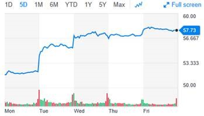

***

\tableofcontents

```{r setup, include=FALSE}
knitr::opts_chunk$set(echo = TRUE)
knitr::opts_chunk$set(cache = TRUE)
knitr::opts_chunk$set(message = FALSE)
knitr::opts_chunk$set(warning = FALSE)
knitr::opts_chunk$set(collapse = TRUE)
```

```{r library, echo=FALSE}
if(!require(dplyr)) install.packages("dplyr", repos = "http://cran.us.r-project.org")
if(!require(ggplot2)) install.packages("ggplot2", repos = "http://cran.us.r-project.org")
if(!require(forecast)) install.packages("forecast", repos = "http://cran.us.r-project.org")
```


\newpage
# Introduction

This report is part of the **Data Science Professional Certificate** program, specifically the final course "Capstone".

 
For this particular project, I chose a topic that interested me before enrolling in this program, in this project we will forecast the stock prices of a certain company, we will analyze **time series**.

To make it more interesting, we will select two similar companies and compare the results in order to determine in which it is convenient to invest. The **data** can be downloaded from the yahoo financial website **<https://finance.yahoo.com/>**.

During this work, we will analyze the data, complete the missing non-working days with interpolated values, decompose the series using loess and moving averages, use different forecasting methods and select the best one.

Finally, we will compare the forecast obtained with the real values.


\newpage
# Analysis

## Data Inspection

We will analyze the data of American Airline (AAL) and Delta Air Line (DAL)

```{r load-data, echo=FALSE}
AAL <- read.csv("./data/AAL.csv", header = TRUE, stringsAsFactors = FALSE) %>% 
  select(Date, Close) %>% 
  mutate(Date = as.Date(Date)) %>%
  filter(Date >= "2017-01-01" & Date < "2019-04-01")

DAL <- read.csv("./data/DAL.csv", header = TRUE, stringsAsFactors = FALSE) %>% 
  select(Date, Close) %>% 
  mutate(Date = as.Date(Date)) %>%
  filter(Date >= "2017-01-01" & Date < "2019-04-01")
```

\small
```{r structure-AAL}
str(AAL)
```

```{r structure-DAL}
str(DAL)
```

\normalsize
In both cases we have 563 observations of 2 variables, one of them is the date of registration and the other is the closing value. The observations are filtered from the beginning of 2017 until May 2019.

\small
```{r head-AAL}
head(AAL)
```

```{r head-DAL}
head(DAL)
```

\normalsize
We also note that certain days have no observations, which corresponds to the holidays and non-working days of the stock exchange, for example, on days 7 and 8 of January 2017.

\small
```{r summary-AAL}
summary(AAL)
```

\normalsize
The observations begin on `r AAL[1,1]` and end on `r max(AAL[,1])`

The minimum closing price was `r round(min(AAL[,2]), 2)` and the maximum was `r round(max(AAL[,2]), 2)`

The average is `r round(mean(AAL[,2]), 2)`

\small
```{r summary-DAL}
summary(DAL)
```

\normalsize
The observations begin on `r DAL[1,1]` and end on `r max(DAL[,1])`

The minimum closing price was `r round(min(DAL[,2]), 2)` and the maximum was `r round(max(DAL[,2]), 2)`

The average is `r round(mean(DAL[,2]), 2)`


## Data Visualization

```{r plot-AAL, echo=FALSE, out.width=c('50%', '50%'), fig.width=4, fig.height=2}
ggplot(data = AAL, aes(x = Date, y = Close))+
  geom_line(color = "red", size = 1) + 
  stat_smooth(color = "#FC4E07", fill = "#FC4E07", method = "loess") +
  ggtitle("AAL Close Price")

ggplot(data = DAL, aes(x = Date, y = Close))+
  geom_line(color = "blue", size = 1) + 
  stat_smooth(color = "#FC4E07", fill = "#FC4E07", method = "loess") +
  ggtitle("DAL Close Price")
```

```{r plot-AAL-DAL, echo=FALSE, fig.width=7, fig.height=2}
ggplot(AAL, aes(Date, Close)) +
  geom_line(aes(color="AAL")) + 
  geom_line(data = DAL, aes(color = "DAL")) +
  ggtitle("Close price") +
  labs(color="Legend") +
  scale_color_manual("", 
                     breaks = c("AAL", "DAL"),
                     values = c("red", "blue"))
```

At first glance, we noticed that the values were quite similar until 2018, and since that year American Airlines began to fall, while Delta Airline remained near to its average.


\newpage
## Data Preparation

The first thing we must do with the data is to convert them into time series using the "ts()" function, but for this we need to have all the observations of each day, so we will complete the original data set with the missed days, with 818 observations finally remaining since January from 2017 to May 2019 (one per day). This will leave us the empty observations that we will have to complete with the interpolated values using the "na.interp()" function.

```{r complete-data-frame, echo=FALSE}
AAL.AllDates <- data.frame("Date" = seq(AAL$Date[1], as.Date("2019-03-31"), "day"))
DAL.AllDates <- data.frame("Date" = seq(DAL$Date[1], as.Date("2019-03-31"), "day"))

AAL <- full_join(AAL.AllDates, AAL, by="Date")
DAL <- full_join(DAL.AllDates, DAL, by="Date")

rm(AAL.AllDates, DAL.AllDates)
```

\small
```{r head-new}
head(AAL, 8)
```

```{r ts, echo=FALSE}
AAL.j <- as.numeric(format(AAL$Date[1], "%j"))
DAL.j <- as.numeric(format(DAL$Date[1], "%j"))

AAL <- ts(AAL$Close, start = c(as.numeric(format(AAL$Date[1], "%Y")), AAL.j), frequency = 365)
DAL <- ts(DAL$Close, start = c(as.numeric(format(DAL$Date[1], "%Y")), DAL.j), frequency = 365)

AAL <- round(na.interp(AAL), 2)
DAL <- round(na.interp(DAL), 2)

rm(AAL.j, DAL.j)
```

```{r head-new-interp}
head(AAL, 8)
```

\normalsize
Note that once the data frame has been converted to a time series, some things changed with the "head()" function, first, we show the start and end dates of the 8 observations shown, starting on day 3 of 2017 and ending on day 10 of the same year. Note also that we did not mention the month, this is because the day makes mention of the day elapsed of the year, and as the first observations are from the month of January, these days coincide in this case.

\small
```{r summary-AAL-ts}
summary(AAL)
```

\normalsize
The observations begin on `r start(AAL)` and end on `r end(AAL)` (remember that the days are elapsed of the year)

The average is `r round(mean(AAL), 2)`

\small
```{r summary-DAL-ts}
summary(DAL)
```

\normalsize
The observations begin on `r start(DAL)` and end on `r end(DAL)` (remember that the days are elapsed of the year)

The average is `r round(mean(DAL), 2)`


\newpage
## Analyzing Time Series

### Classical Seasonal Decomposition by Moving Averages

Decompose a time series into seasonal, trend and irregular components using moving averages. Deals with additive or multiplicative seasonal component.

The additive model used is 
\small
$$ Y[{t}] = T[{t}] + S[{t}] + e[{t}] $$
\normalsize
The multiplicative model used is: 
\small
$$ Y[{t}] = T[{t}] * S[{t}] * e[{t}] $$

```{r decompose, echo=FALSE}
AAL.decompose <- decompose(AAL)
DAL.decompose <- decompose(DAL)
```

```{r plot-AAL-decompose, fig.width=8, fig.height=5}
plot(AAL.decompose)
```

\newpage
```{r plot-DAL-decompose, fig.width=8, fig.height=5}
plot(DAL.decompose)
```


\normalsize

### Seasonal Decomposition of Time Series by Loess

Decompose a time series into Seasonal, Trend and irregular components using loess, acronym STL.

The seasonal component is found by loess smoothing the seasonal sub-series (the series of all January values, ...); if s.window = "periodic" smoothing is effectively replaced by taking the mean. The seasonal values are removed, and the remainder smoothed to find the trend. The overall level is removed from the seasonal component and added to the trend component. This process is iterated a few times. The remainder component is the residuals from the seasonal plus trend fit.

```{r stl, echo=FALSE}
AAL.stl <- stl(AAL, s.window = "periodic")
DAL.stl <- stl(DAL, s.window = "periodic")
```

\newpage
```{r plot-AAL-stl, fig.width=8, fig.height=4}
plot(AAL.stl)
```

```{r plot-DAL-stl, fig.width=8, fig.height=4}
plot(DAL.stl)
```

In both decompositions "decompose()" and "stl()", a seasonality is appreciated for both AAL and DAL, increasing the values at the beginning of the year and presenting high volatility in the middle of the year. We also see that the AAL trend is downward, while DAL decreases to a lesser extent


\newpage
## Forecasting

### Exponential Smoothing Forecasts

Returns forecasts and other information for exponential smoothing forecasts applied to a time series. 

```{r ses, echo=FALSE}
AAL.ses <- ses(AAL, h = 365)
DAL.ses <- ses(DAL, h = 365)
```

```{r plot-AAL-ses, fig.width=8, fig.height=4}
plot(AAL.ses)
```

```{r plot-DAL-ses, fig.width=8, fig.height=4}
plot(DAL.ses)
```


### ARIMA Modelling of Time Series

Fit an ARIMA model to a univariate time series. Autoregressive integrated moving average (ARIMA)

```{r arima, echo=FALSE}
AAL.arima <- auto.arima(AAL)
DAL.arima <- auto.arima(DAL)
```

```{r echo=FALSE}
AAL.fore.ari <- forecast(AAL.arima, h = 30)
DAL.fore.ari <- forecast(DAL.arima, h = 30)
```

```{r plot-AAL-arima, fig.width=8, fig.height=4}
plot(AAL.fore.ari, col = "red")
```

```{r plot-DAL-arima, fig.width=8, fig.height=4}
plot(DAL.fore.ari, col = "blue")
```


\newpage
### Forecasting using Holt-Winters objects

Returns forecasts and other information for univariate Holt-Winters time series models. This function calls predict. HoltWinters and constructs an object of class "forecast" from the results.

```{r echo=FALSE}
AAL.hw <- HoltWinters(AAL)
DAL.hw <- HoltWinters(DAL)
```

```{r, fig.width=8, fig.height=4}
plot(AAL.hw, col = "red", col.predicted = "grey")
```

```{r, fig.width=8, fig.height=4}
plot(DAL.hw, col = "blue", col.predicted = "grey")
```

```{r echo=FALSE}
AAL.fore <- forecast(AAL.hw, h=30)
DAL.fore <- forecast(DAL.hw, h=30)
```


\newpage
# Results

After reviewing the previous methods, the best method was HoltWinters. Here we can clearly appreciate the continuity of the original curve

```{r, fig.width=8, fig.height=4}
plot(AAL.fore)
```

```{r, fig.width=8, fig.height=4}
plot(DAL.fore)
```

Now, according to the forecast, we can recommend buying shares of the DAL stock exchange instead of AAL, since the value of the first will remain in the future, while the second will be in constant decline.

Now we will do a check somewhat different from the traditional method of separating data in training and testing. We will check the forecast directly with the real values of this first week of April. Unfortunately at the time of making this report, the data was not yet available to be downloaded, but we could see it, so we will check against that image

\small
```{r}
DAL.fore$lower[1:5,]

DAL.fore$upper[1:5,]
```

```{r echo=FALSE, out.width='100%'}

```

We can verify that effectively the forecast approaches the upper limit of 95%.


\newpage
\normalsize

# Conclusions

We can conclude that it is not advisable to buy shares of American Airlines, since they are going down.

The shares of Delta Air Lines on the other hand remain close to their average, and rising at certain times, so our recommendation would be to invest in this company.

Try different methods of forecasting served us first to learn, and secondly to choose the one that best suited what we were looking for and to make a decision based on the method of our choice.

**Note:** the incorporation of almost all the code within the report was intentional with the purpose of showing the complete procedure of analysis of this work.